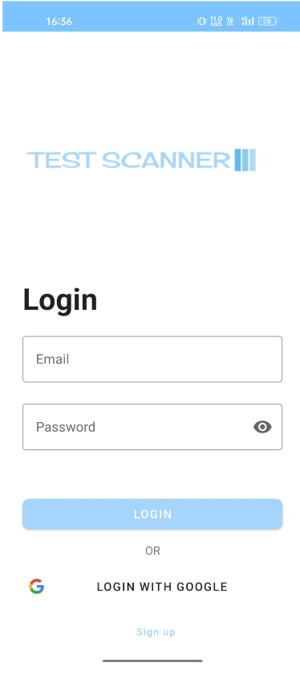
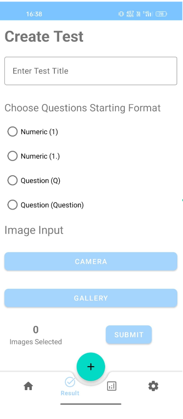
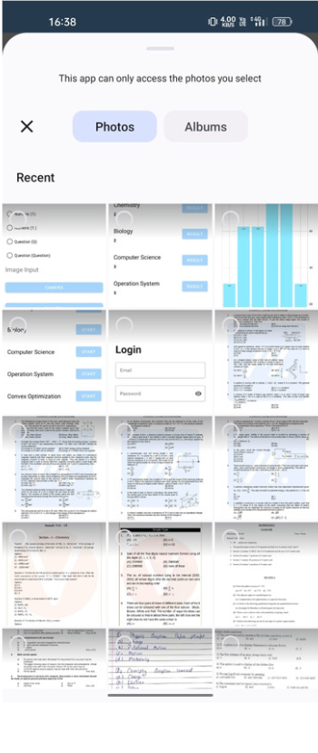
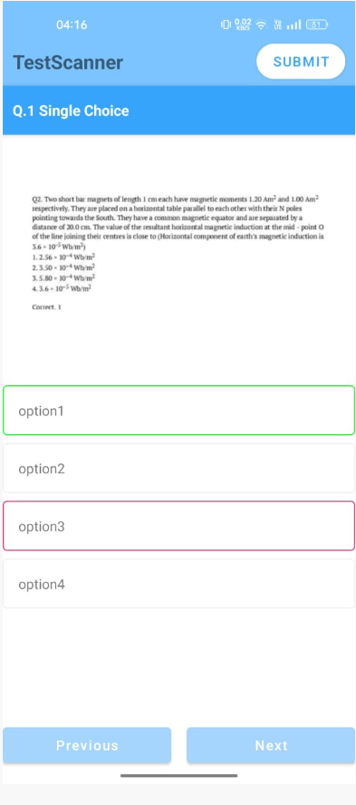
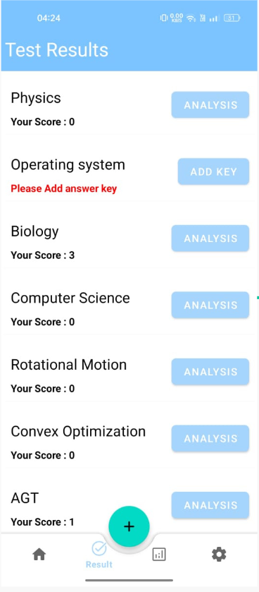

# TestScanner App

</a>

TestScanner App is a powerful and innovative Android application that allows you to convert any paper-based MCQ test into an online mobile-based test with just a simple scan. With its exceptional accuracy and advanced features, TestScanner App is the ultimate solution for students, teachers, and educators who want to save time and effort in creating and grading MCQ tests.

## Features

* **Easy Scan:** TestScanner App makes it easy to scan your paper-based MCQ tests using your Android device. Simply open the app, select the scan option, and snap a picture of your test paper. The app will automatically recognize the test questions and options using the Google Vision API.

* **Online Test:** With TestScanner App, you can easily convert your paper-based MCQ test into an online mobile-based test. The app provides you with an intuitive interface that allows you to customize your test, set a timer, and create an answer key.

* **Accurate Grading:** TestScanner App is equipped with advanced algorithms that ensure accurate grading of your tests. The app can detect incorrect answers, provide instant feedback to students, and generate detailed performance reports.

* **Performance Analysis:** With TestScanner App, you can easily analyze the performance of your students. The app provides you with detailed reports that show you the strengths and weaknesses of each student.

* **Firebase Integration:** TestScanner App uses Firebase Authentication to authenticate users and Firebase Firestore to store and retrieve data. This ensures the security and reliability of your data.

* **MaterialUI Design:** TestScanner App uses MaterialUI to design a beautiful and user-friendly interface.

## Screenshots

||  | ||
||  | ||
||  | ||

## Compatibility

TestScanner App is compatible with Android devices running Android 5.0 (Lollipop) or later. It requires a camera with autofocus capability for accurate scanning.

## Dependencies

TestScanner App uses the following libraries:

* Firebase Auth: to authenticate users
* Firebase Firestore: to store and retrieve data
* Volley: to communicate with the server
* Gson: to parse JSON responses from the server
* Google Vision: to recognize text from images
* MaterialUI: to design the user interface
* Recycler View: to display results

## Getting Started

To get started with TestScanner App, simply download the app from the Google Play Store. Once you have installed the app, open it and follow the on-screen instructions to start scanning your paper-based MCQ tests.

## Feedback

We are committed to providing you with the best possible experience with TestScanner App. If you have any feedback, suggestions, or questions, please do not hesitate to contact us at [email protected] We would love to hear from you!

## License

This project is licensed under the MIT License - see the LICENSE file for details.

## Conclusion

TestScanner App is the ultimate solution for anyone who wants to save time and effort in creating and grading MCQ tests. With its advanced features and exceptional accuracy, TestScanner App is the future of education. Download the app today and experience the power of TestScanner App!

- [x] MainActivity
- [x] Api Response
- [x] Response Manipulation
- [x] Test Screen
- [X] Firestore
- [X] Authentication
- [X] Camera Multiple Images
- [x] Images Preview

